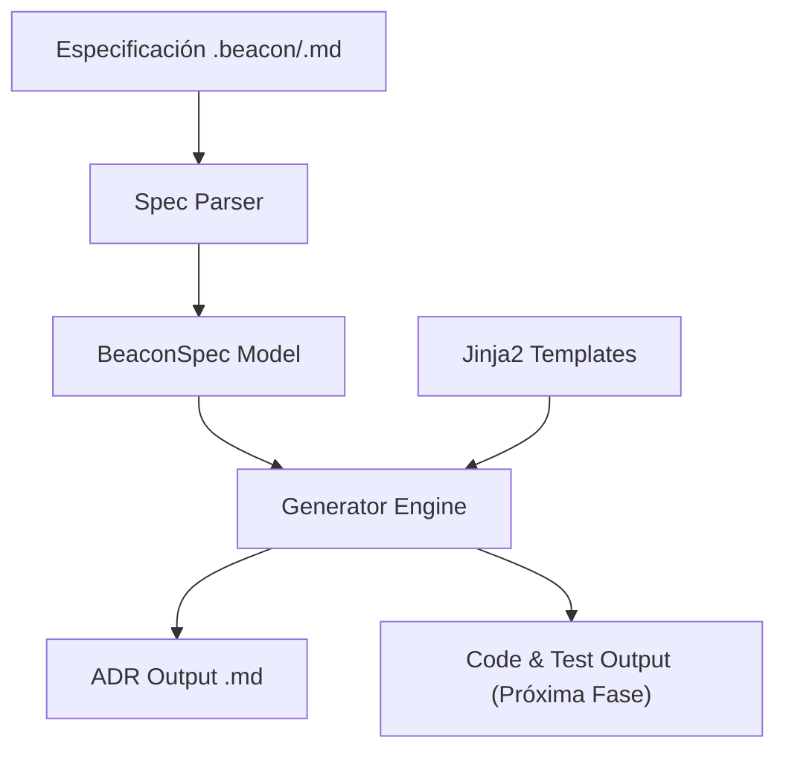

# Beacon CLI

```text
██████╗ ███████╗ █████╗  ██████╗ ██████╗ ███╗   ██╗
██╔══██╗██╔════╝██╔══██╗██╔════╝██╔═══██╗████╗  ██║
██████╔╝█████╗  ███████║██║     ██║   ██║██╔██╗ ██║
██╔══██╗██╔══╝  ██╔══██║██║     ██║   ██║██║╚██╗██║
██████╔╝███████╗██║  ██║╚██████╗╚██████╔╝██║ ╚████║
╚══════╝ ╚══════╝╚═╝  ╚═╝ ╚═════╝ ╚═════╝ ╚═╝  ╚═══╝
```

Beacon es una herramienta de línea de comandos (CLI) escrita en Python que automatiza la creación de Architecture Decision Records (ADRs), plantillas de código y stubs de pruebas unitarias a partir de especificaciones técnicas semi-estructuradas.

## Propósito

El objetivo principal de Beacon es reducir la fricción en el desarrollo de software eliminando la creación manual de boilerplate técnico. Traduce de manera inmediata una especificación de requerimientos en archivos estructurados y listos para la integración.

## Arquitectura y Resolución

El flujo de Beacon consta de tres fases principales a grandes rasgos:



1. **Parser de Especificaciones**: Lee archivos de especificación (`.md` o `.beacon`) extrayendo metadatos estructurados mediante bloques YAML Frontmatter y parsing de secciones estándar en Markdown (e.g., *Context*, *Decision*, *Consequences*).
2. **Modelado**: Valida y parsea el contenido a través de un esquema fuertemente tipado en Pydantic (`BeaconSpec`).
3. **Generación**: Compila e inyecta los metadatos en plantillas de Jinja2. Admite la resolución y sobrescritura de plantillas del usuario desde un directorio raíz (`templates/`) priorizándolo frente a las integradas por defecto en el paquete.

---

## Requisitos de Entorno

* Python 3.11+
* Gestión de dependencias compatible con `uv` o `poetry`.

---

## Comandos Principales

### 1. Verificación
```bash
beacon version
```

### 2. Generación de Artefactos
```bash
beacon generate specs/example.beacon --output specs_output/
```

Opciones de generación:
* `--config` / `-c`: Especificar un archivo de configuración personalizado.
* `--output` / `-o`: Sobrescribir el directorio de salida.
* `--templates` / `-t`: Ruta para inyectar un directorio de plantillas Jinja2 personalizadas.
