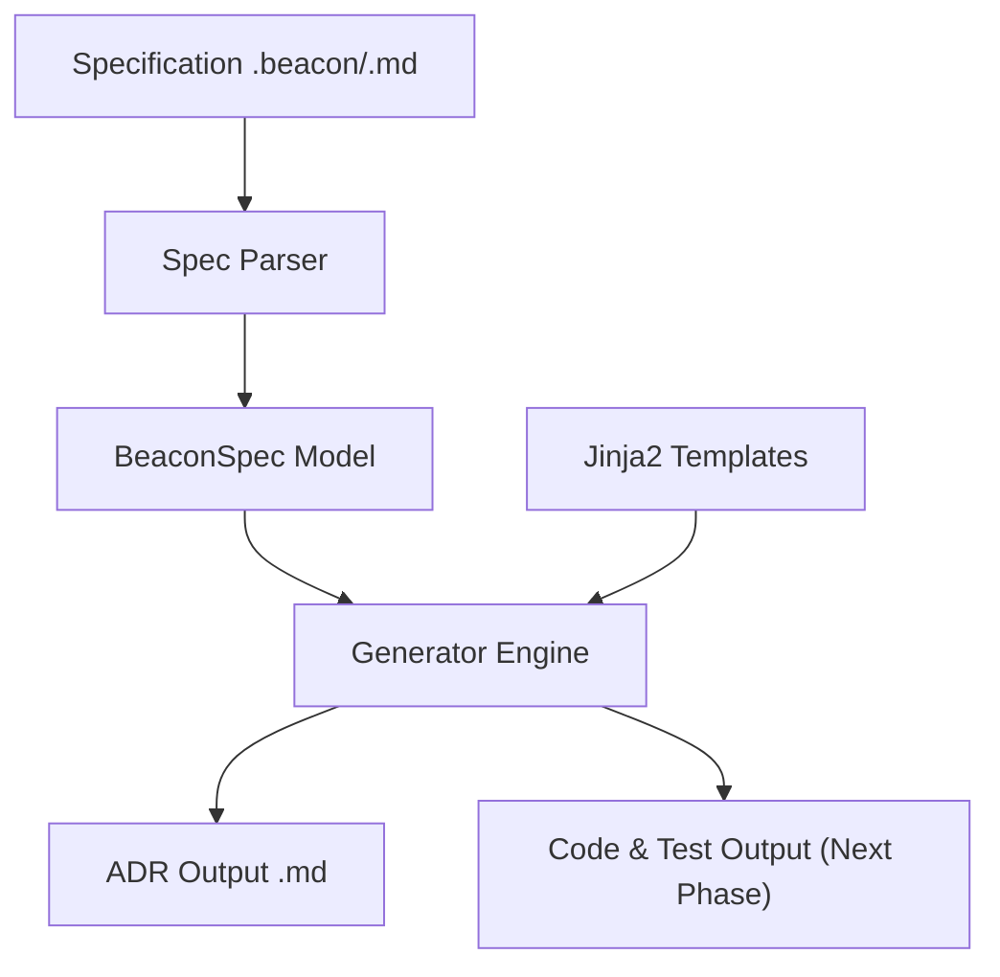

# Beacon CLI

```text
╔══════════════════════════════════════════════════════════════╗
║  * Welcome to the Beacon CLI developer preview!              ║
╚══════════════════════════════════════════════════════════════╝

██████╗ ███████╗ █████╗  ██████╗ ██████╗ ███╗   ██╗
██╔══██╗██╔════╝██╔══██╗██╔════╝██╔═══██╗████╗  ██║
██████╔╝█████╗  ███████║██║     ██║   ██║██╔██╗ ██║
██╔══██╗██╔══╝  ██╔══██║██║     ██║   ██║██║╚██╗██║
██████╔╝███████╗██║  ██║╚██████╗╚██████╔╝██║ ╚████║
╚══════╝ ╚══════╝╚═╝  ╚═╝ ╚═════╝ ╚═════╝ ╚═╝  ╚═══╝
```

[](https://pypi.org/project/beacon-cli/)
[](https://github.com/Agustin-de-Oliveira/Beacon/blob/master/LICENSE)
[](https://pypi.org/project/beacon-cli/)

Beacon is a Python-based command-line interface (CLI) tool that automates the generation of Architecture Decision Records (ADRs), boilerplate code, and test stubs from semi-structured technical specifications.

---

## Key Features

*   **Specification Validation**: Safe configuration parsing with automatic data validation via Pydantic.
*   **Hybrid Parser**: Supports specification files (`.md` or `.beacon`), parsing both YAML frontmatter metadata and native Markdown section headers.
*   **Flexible Template Engine (Jinja2)**: Generates technical artifacts using pre-built default templates or custom user-defined templates loaded from a local directory (`templates/`).
*   **Resilient Output**: Rich-colored CLI console that checks the terminal encoding (`sys.stdout`) to prevent crashes and automatically falls back to safe ASCII rendering.

---

## Practical Use Case: Bootstrapping a New Service

Imagine you are starting a new microservice (e.g., a **Payment Gateway**). Before writing any code, you need to align on design decisions and set up the codebase. 

Instead of manually creating ADR templates, setting up boilerplate folders, and writing empty test files, you can define your service spec in a single file (`payment_service.beacon`):

1. **Documenting Decisions**: Describe the architectural choice (e.g., "Use Stripe API for credit card processing").
2. **Structuring Modules**: List the core modules you need to bootstrap (e.g., `stripe_client`, `webhooks`, `billing`).

When you run `beacon generate payment_service.beacon`, Beacon automatically:
*   Generates a formal Markdown ADR (e.g., `adr_use_stripe_api_for_credit_card_processing.md`) detailing the context, decision, and consequences.
*   Prepares your Python module files and folder structure (Next phase).
*   Generates basic unit test suites matching your modules (Next phase).

This ensures every new module in your organization starts with structured, consistent documentation and boilerplate code in under a second.

---

## Example: Before & After

### 1. Input Specification (`specs/example.beacon`)

```markdown
---
project_name: "BeaconDemo"
adr:
  title: "Use PostgreSQL for Core Data Storage"
  status: "Accepted"
  date: "2026-05-24"
modules:
  - "auth"
  - "billing"
---

# Use PostgreSQL for Core Data Storage

## Context
We need a robust database to store user authentication and billing records.

## Decision
We will use PostgreSQL as our primary database engine.

## Consequences
- Alembic will handle migrations.
- Development will use Docker.
```

### 2. Command
```bash
beacon generate specs/example.beacon --output specs_output/
```

### 3. Generated Output (`specs_output/adr_use_postgresql_for_core_data_storage.md`)

```markdown
# ADR: Use PostgreSQL for Core Data Storage

* **Status:** Accepted
* **Date:** 2026-05-24

## Context and Problem Statement

We need a robust database to store user authentication and billing records.

## Decision Outcome

We will use PostgreSQL as our primary database engine.

## Consequences

- Alembic will handle migrations.
- Development will use Docker.
```

---

## Architecture Overview

At a high level, Beacon's pipeline operates in three main stages:



---

## Installation

### Via `pipx` (Recommended for global CLI usage)
```bash
pipx install beacon-cli
```

### Via `uv` or standard `pip`
```bash
uv tool install beacon-cli
# or
pip install beacon-cli
```

---

## Available Commands

### Check CLI Version
```bash
beacon version
```

### Generate Artifacts
```bash
beacon generate [PATH_SPEC] [OPTIONS]
```

**Options:**
*   `PATH_SPEC` (Required): Path to the `.md` or `.beacon` specification file.
*   `-o, --output PATH`: Override the output directory for generated files.
*   `-t, --templates PATH`: Path to a custom directory for Jinja2 templates.
*   `-c, --config PATH`: Path to a custom configuration file (`beacon.yaml` / `.json`).
