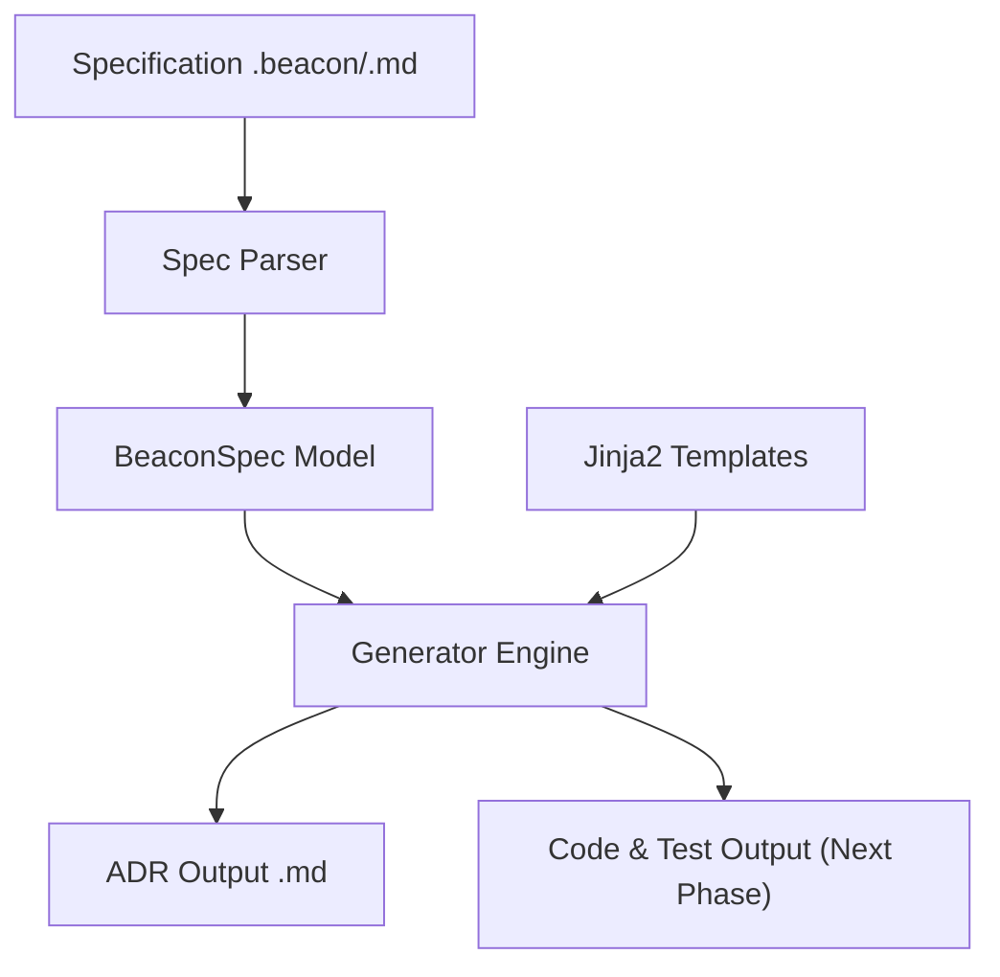

```text
                            ██████╗ ███████╗ █████╗  ██████╗ ██████╗ ███╗   ██╗
                            ██╔══██╗██╔════╝██╔══██╗██╔════╝██╔═══██╗████╗  ██║
                            ██████╔╝█████╗  ███████║██║     ██║   ██║██╔██╗ ██║
                            ██╔══██╗██╔══╝  ██╔══██║██║     ██║   ██║██║╚██╗██║
                            ██████╔╝███████╗██║  ██║╚██████╗╚██████╔╝██║ ╚████║
                            ╚══════╝ ╚══════╝╚═╝  ╚═╝ ╚═════╝ ╚═════╝ ╚═╝  ╚═══╝
```
 
[](https://pypi.org/project/beacon-cli/)
[](https://github.com/Agustin-de-Oliveira/Beacon/blob/master/LICENSE)
[](https://pypi.org/project/beacon-cli/)
 
You write a spec. Beacon writes the architecture records, scaffolds the modules, and keeps everything consistent, no matter who wrote the code.
 
---
 
## How it works
 
Write a `.beacon` spec describing your decision and modules:
 
```markdown
---
project_name: "BeaconDemo"
adr:
  title: "Use PostgreSQL for Core Data Storage"
  status: "Accepted"
  date: "2026-05-24"
modules:
  - "auth"
  - "billing"
---
 
## Context
We need a robust database for user authentication and billing records.
 
## Decision
We will use PostgreSQL as our primary database engine.
 
## Consequences
- Alembic will handle migrations.
- Development will use Docker.
```
 
Run one command:
 
```bash
beacon generate specs/example.beacon --output specs_output/
```
 
Get a standardized ADR:
 
```markdown
# ADR: Use PostgreSQL for Core Data Storage
 
* **Status:** Accepted
* **Date:** 2026-05-24
 
## Context and Problem Statement
 
We need a robust database for user authentication and billing records.
 
## Decision Outcome
 
We will use PostgreSQL as our primary database engine.
 
## Consequences
 
- Alembic will handle migrations.
- Development will use Docker.
```
 
---
 
## Why Beacon?
 
AI coding tools make it easy to move fast. They also make it easy to accumulate hundreds of undocumented decisions, inconsistent patterns, and no clear record of why anything was built the way it was.
 
Beacon sits upstream of that problem. You define modules, constraints, and decisions before writing code, and Beacon turns those into artifacts that live alongside your codebase. Templates keep generated files consistent no matter who wrote the logic.
 
One failure mode Beacon explicitly avoids: using AI to verify AI-generated code. That's a closed loop with no external reference point. Validation is deterministic: `pytest` suites and AST matching. The Python interpreter decides what's correct. The developer reviews anything that matters.
 
---
 
## Roadmap
 
- **Phase 1 — Current**: Parse specs, validate via Pydantic, generate ADRs from Jinja2 templates.
- **Phase 2**: Deterministic scaffolding: auto-generate Python modules, folders, and `pytest` stubs from the spec.
- **Phase 3**: Optional LLM connectors (OpenAI / Gemini / Ollama) to generate initial implementations and real unit tests.
- **Phase 4**: Interactive `beacon init` wizard to scaffold spec files through a CLI questionnaire.
- **Phase 5**: CI/CD checks to ensure pull requests conform to accepted ADRs.
---
 
## AI & API Keys
 
Phase 3 will follow a BYOK (Bring Your Own Key) model: no API key is ever bundled or hardcoded. Set yours as an environment variable and Beacon reads it at runtime:
 
```bash
export GEMINI_API_KEY="AIzaSy..."   # or OPENAI_API_KEY, etc.
```
 
[Ollama](https://ollama.com) is also supported for offline usage. If it's running locally, Beacon routes requests to `http://localhost:11434` automatically. Google Gemini's free tier (Gemini 1.5 Flash, 15 req/min) works too, no card required.
 
---
 
## Architecture
 

 
---
 
## Installation
 
```bash
pipx install beacon-cli   # recommended
```
 
```bash
uv tool install beacon-cli
# or
pip install beacon-cli
```
 
## Commands
 
```bash
beacon version
 
beacon generate [PATH_SPEC] [OPTIONS]
  -o, --output PATH      Output directory for generated files
  -t, --templates PATH   Custom Jinja2 templates directory
  -c, --config PATH      Custom config file (beacon.yaml / .json)
```
