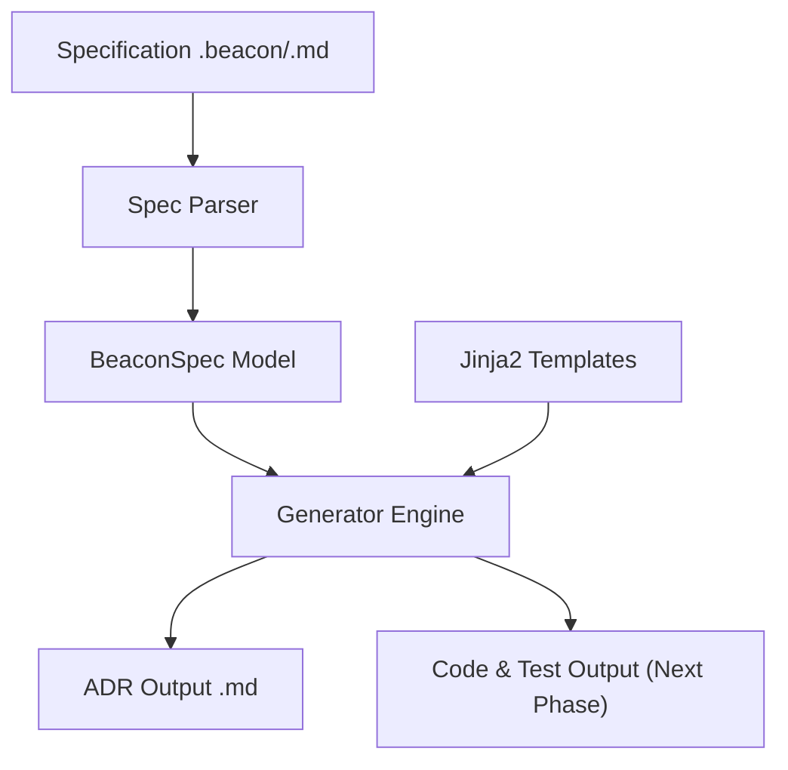

# Beacon CLI

```text
╔══════════════════════════════════════════════════════════════╗
║  * Welcome to the Beacon CLI developer preview!              ║
╚══════════════════════════════════════════════════════════════╝

██████╗ ███████╗ █████╗  ██████╗ ██████╗ ███╗   ██╗
██╔══██╗██╔════╝██╔══██╗██╔════╝██╔═══██╗████╗  ██║
██████╔╝█████╗  ███████║██║     ██║   ██║██╔██╗ ██║
██╔══██╗██╔══╝  ██╔══██║██║     ██║   ██║██║╚██╗██║
██████╔╝███████╗██║  ██║╚██████╗╚██████╔╝██║ ╚████║
╚══════╝ ╚══════╝╚═╝  ╚═╝ ╚═════╝ ╚═════╝ ╚═╝  ╚═══╝
```

[](https://pypi.org/project/beacon-cli/)
[](https://github.com/Agustin-de-Oliveira/Beacon/blob/master/LICENSE)
[](https://pypi.org/project/beacon-cli/)

Beacon is a Python-based command-line interface (CLI) tool that automates the generation of Architecture Decision Records (ADRs), boilerplate code, and test stubs from semi-structured technical specifications.

---

## Key Features

*   **Specification Validation**: Safe configuration parsing with automatic data validation via Pydantic.
*   **Hybrid Parser**: Supports specification files (`.md` or `.beacon`), parsing both YAML frontmatter metadata and native Markdown section headers.
*   **Flexible Template Engine (Jinja2)**: Generates technical artifacts using pre-built default templates or custom user-defined templates loaded from a local directory (`templates/`).
*   **Resilient Output**: Rich-colored CLI console that checks the terminal encoding (`sys.stdout`) to prevent crashes and automatically falls back to safe ASCII rendering.

---

## Why Beacon? (The Alternative to "Vibe Coding")

As AI-assisted programming tools (like Cursor, Copilot, or raw LLMs) become standard, it is increasingly easy to generate massive amounts of disconnected code without structured planning—often referred to as **"vibe coding"**. This can lead to undocumented decisions, inconsistent code patterns, and fast-growing technical debt.

Beacon aims to act as a **disciplined companion** to your development workflow:
*   **Spec-First, Code-Second**: It encourages defining architectural constraints and modules in a simple specification file *before* writing code.
*   **Architectural Linter**: Enforces a single, validated source of truth for design decisions (ADRs) and structural codebases.
*   **Targeted Scaffolding**: Uses pre-configured team templates to generate code and tests, keeping files globally consistent even when different developers or AI tools write the logic.

---

## Project Roadmap

Beacon is being built in modular phases:
*   **Phase 1 (Current)**: Parse YAML/Markdown specifications, validate structure via Pydantic, and compile standardized ADR files using Jinja2 templates.
*   **Phase 2 (Upcoming)**: Support deterministic file scaffolding. Auto-generate empty Python module files, folders, and basic `pytest` stubs from the specification definition.
*   **Phase 3 (AI Integration)**: Integrate optional LLM connectors (OpenAI/Gemini/Ollama) to read the specification context and generate initial functional code implementations and actual unit tests instead of leaving them empty.
*   **Phase 4 (Interactive Wizard)**: Add an interactive CLI questionnaire (`beacon init`) to generate spec files easily.
*   **Phase 5 (CI/CD Verification)**: Implement checking pipelines to ensure pull requests conform to accepted ADRs and block contradictory changes.

---

## Example: Before & After

Beacon takes your loose metadata and informal section headers and maps them into a standard, validated industry format:

| Input Spec Component (`specs/example.beacon`) | Transformation / Mapping | Mapped to Output ADR |
| :--- | :--- | :--- |
| **YAML Metadata (`adr.status: "Accepted"`)** | Validated via Pydantic validation rules | Metadata block: `* **Status:** Accepted` |
| **YAML Metadata (`adr.date: "2026-05-24"`)** | Formatted to standard date object | Metadata block: `* **Date:** 2026-05-24` |
| **Markdown Section Heading (`## Context`)** | Mapped to structured MADR format | Standard Heading: `## Context and Problem Statement` |
| **Markdown Section Heading (`## Decision`)** | Mapped to structured MADR format | Standard Heading: `## Decision Outcome` |
| **List of Target Modules (`modules`)** | Mapped to codebase scaffolding | Bootstraps python files & unit test suites (Next phase) |

### 1. Input Specification (`specs/example.beacon`)

```markdown
---
project_name: "BeaconDemo"
adr:
  title: "Use PostgreSQL for Core Data Storage"
  status: "Accepted"
  date: "2026-05-24"
modules:
  - "auth"
  - "billing"
---

# Use PostgreSQL for Core Data Storage

## Context
We need a robust database to store user authentication and billing records.

## Decision
We will use PostgreSQL as our primary database engine.

## Consequences
- Alembic will handle migrations.
- Development will use Docker.
```

### 2. Command
```bash
beacon generate specs/example.beacon --output specs_output/
```

### 3. Generated Output (`specs_output/adr_use_postgresql_for_core_data_storage.md`)

```markdown
# ADR: Use PostgreSQL for Core Data Storage

* **Status:** Accepted
* **Date:** 2026-05-24

## Context and Problem Statement

We need a robust database to store user authentication and billing records.

## Decision Outcome

We will use PostgreSQL as our primary database engine.

## Consequences

- Alembic will handle migrations.
- Development will use Docker.
```

---

## Architecture Overview

At a high level, Beacon's pipeline operates in three main stages:



---

## Installation

### Via `pipx` (Recommended for global CLI usage)
```bash
pipx install beacon-cli
```

### Via `uv` or standard `pip`
```bash
uv tool install beacon-cli
# or
pip install beacon-cli
```

---

## Available Commands

### Check CLI Version
```bash
beacon version
```

### Generate Artifacts
```bash
beacon generate [PATH_SPEC] [OPTIONS]
```

**Options:**
*   `PATH_SPEC` (Required): Path to the `.md` or `.beacon` specification file.
*   `-o, --output PATH`: Override the output directory for generated files.
*   `-t, --templates PATH`: Path to a custom directory for Jinja2 templates.
*   `-c, --config PATH`: Path to a custom configuration file (`beacon.yaml` / `.json`).
